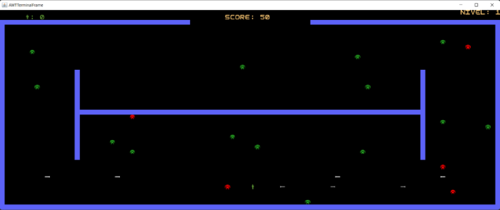

## LDTS_1007 - Berzerk

Berzerk é um jogo de ação e tiro em que o jogador tem por objetivo passar todos os niveis sem ser morto, podendo disparar e destruir monstros e tendo que ter sempre cuidado para não bater nas paredes porque são eletrificadas. A cada nível corresponde um mapa diferente e os monstros vao ficando também mais fortes e desenvolvendo capacidade de tiro. Além disso, apesar de uma abordagem pacifista ser possivel, não há muito espaço para o sucesso, visto que os inimigos são uma ameaça constante. 

Este projeto foi desenvolvido por Catarina Canelas (up202103631@fe.up.pt), Diogo Gomes (up201505676@fe.up.pt) e Rui Soares (up202103631@fe.up.pt) para Laboratório de Desenho e Teste de Software, 2021/22.

Para uma versão mais detalhada carregue [aqui](docs/README.md)

## Features

- [x] **Menus** - A navegação é feita através das setas do teclado e a opção a selecionar com Enter.
    - PLAY;
    - SETTINGS;
    - LEADERBOARD;
    - EXIT.
- [x] **Leaderboard** - Possibilidade de ver o ‘top’ 5 de melhores jogadores.
- [x] **Escolha de Herói** - Possibilidade de escolher o herói com que se pretende jogar, na opção 'SETTINGS'. Cada herói tem as suas particularidades.
    - Herói Recruit - Herói com Estatisticas Básicas.
    - Herói Tanky - Herói com pontos Extra de Vida.
    - Herói Expert - Herói com cadência de tiro mais elevada.
- [x] **Movimentação do Herói** - O herói movimenta-se para os quatro sentidos usando as setas do teclado.
- [x] **Morte do Herói** - O herói morre se tiver contacto com as paredes eletrizadas, com os monstros ou com as balas destes.
- [x] **Movimentação dos Monstros** - Os monstros movimentam-se sozinhos. Com o avançar dos niveis, podem movimentar-se mais rapidamente.
- [x] **Disparos do Herói** - O herói pode disparar usando o espaço do teclado.
- [x] **Construção de stones** - O herói pode criar stones estilo FORTNITE 2D usando a tecla x para se proteger dos tiros dos inimigos.
- [x] **Disparos dos Monstros** - Os monstros podem disparar balas a partir do nivel 2.
- [x] **Morte dos Monstros** - Um monstro atingido por uma bala morre. Monstros em diferentes níveis podem necessitar de mais do que uma bala para morrerem.
- [x] **Passagem de niveis** - A passagem de niveis dá-se com a chegada do herói à parte aberta do mapa. No último nivel, o objetivo é apanhar a taça do jogo.
- [x] **Menu de Fim de Jogo** - Se o heroi morrer ou chegar ao fim do jogo aparece GAME OVER e o SCORE conseguido e é-lhe permitido registar o nome.

## Screenshots

### Mockups de todos os mapas 

#### Mapa 1

#### Mapa 2

#### Mapa 3

#### Mapa 4

#### Mapa 5

### Screenshots

#### Menu Principal do Jogo

#### Exemplo do jogo no mapa 2

#### Exemplo do jogo completo 

#### Exemplo do final do jogo - taça

#### Meme Inspiracional

