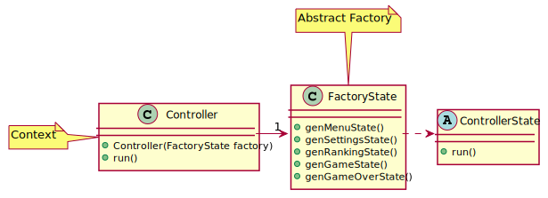

# LDTS_1007 - Berzerk

Pretendemos recriar o jogo Berzerk do Atari 2600, com algumas mudanças, nomeadamente, utilizar mais do que 1 Heroi (Recruit, Tanky, Expert), e dar-lhe um protótipo de história.
Berzerk é um jogo de ação e tiro em que o jogador tem por objetivo passar todos os niveis sem ser morto, podendo disparar e destruir monstros e tendo que ter sempre cuidado para não bater nas paredes porque são eletrificadas. 
A cada nível corresponde um mapa diferente e os monstros vao ficando também mais fortes e desenvolvendo capacidade de tiro. 
Além disso, apesar de uma abordagem pacifista ser possivel, não há muito espaço para o sucesso, visto que os inimigos são uma ameaça constante.

Este projeto foi desenvolvido por *Catarina Canelas* (*up202103631*@fe.up.pt), *Diogo Gomes* (*up201505676*@fe.up.pt) e *Rui Soares* (*up202103631*@fe.up.pt) para LDTS 2021/22

### IMPLEMENTED FEATURES

- **Menus** - A navegação é feita através das setas do teclado e a opção a selecionar com Enter.
    - PLAY;
    - SETTINGS;
    - LEADERBOARD;
    - EXIT.
- **Leaderboard** - Possibilidade de ver o ‘top’ 5 de melhores jogadores.
- **Escolha de Herói** - Possibilidade de escolher o herói com que se pretende jogar, na opção 'SETTINGS'. Cada herói tem as suas particularidades.
    - Herói Recruit - Herói com Estatisticas Básicas.
    - Herói Tanky - Herói com pontos Extra de Vida.
    - Herói Expert - Herói com cadência de tiro mais elevada.
- **Movimentação do Herói** - O herói movimenta-se para os quatro sentidos usando as setas do teclado.
- **Morte do Herói** - O herói morre se tiver contacto com as paredes eletrizadas, com os monstros ou com as balas destes.
- **Movimentação dos Monstros** - Os monstros movimentam-se sozinhos. Com o avançar dos niveis, podem movimentar-se mais rapidamente.

### PLANNED FEATURES
- **Disparos do Herói** - O herói pode disparar usando o espaço do teclado.
- **Disparos dos Monstros** - Os monstros podem disparar balas a partir do nivel 2.
- **Morte dos Monstros** - Um monstro atingido por uma bala morre. Monstros em diferentes níveis podem necessitar de mais do que uma bala para morrerem.
- **Passagem de niveis** - A passagem de niveis dá-se com a chegada do herói à parte aberta do mapa. No último nivel, o objetivo é apanhar a taça do jogo.
- **Interrupção do jogo** - Usando a tecla 'esc' do teclado é possivel parar o jogo e aceder a um Menu.
- **Menu de Fim de Jogo** - Se o heroi morrer ou chegar ao fim do jogo aparece GAME OVER e o SCORE conseguido e é-lhe permitido registar o nome, e de seguida um menu com as opções TRY AGAIN e EXIT.

### DESIGN

#### ESTRUTURA GERAL

**Contexto do Problema**

Desde o início do projeto que sabiamos que deveriamos ter uma certa estrutura.
Sabendo que iriamos precisar de Interfaces Gráficas (tanto para menus como para o jogo), decidimos utilizar um padrão em específico para nos ajudar com a organização da estrutura do projeto.

**O Padrão**

Aplicamos especialmente o Padrão **Architectural**, específicamente o estilo **MVC** (Model-View-Controller), que nos ajuda a organizar as diferentes etapas de interação com o Utilizador.

**Implementação**

Agora, independentemente da implementação, podemos dividir as classes do seguinte modo:
- Model: Guardar Dados e Informações sobre o jogo e outras interações.
- Control: Controlam a lógica do jogo e outras interações.
- View: Responsáveis pelos Draws na screen.

Estes tipos de classes organizam-se do seguinte modo:

**Consequências**

O uso do padrão no design atual concede-nos os seguintes benefícios:
- Código bem organizado e respeitando o Single Responsability Principle
- É fácil de adicionar novas funcionalidades ao longo do desenvolvimento do projeto.
- Não se cria tantas disrupções durante o desenvolvimento do projeto.

#### VIAJAR ENTRE MENUS

**Contexto do Problema**

O jogador deve conseguir viajar entre menus.

**O Padrão**

Aplicamos o Padrão **State**.

Permite-nos representar diferentes estados através de diferentes Subclasses. É possível mudar o estado da aplicação apenas transitando entre implementações (i.e. subclasses). Este padrão foi utilizado por simplificar significativamente a forma como representávamos os menus.

**Implementação**

A seguinte imagem monstra como o Padrão foi aplicado às classes da aplicação.

Estas Classes podem ser encontradas nos seguintes ficheiros:

- [Controller](../src/main/java/berzerk.control/Controller.java)
- [ControllerState](../src/main/java/berzerk.control/state/ControllerState.java)
- [MenuState](../src/main/java/berzerk.control/state/FactoryState.java)
- [RankingMenuState](../src/main/java/berzerk.control/state/RankingMenuState.java)
- [SettingsMenuState](../src/main/java/berzerk.control/state/SettingsMenuState.java)
- [GameOverState](../src/main/java/berzerk.control/state/GameOverState.java)

**Consequências**

O uso do Padrão State abre caminho aos seguintes benefícios:
- Os vários estados apresentados ao utilizador ficam destacados em código, em vez de ficarem todos na mesma classe.
- É descartada a utilização de um switch de proporções colossais para mudar entre estados; em vez disso, o polimorfismo gere os estados usados no seu devido momento.
- Há mais classes para gerir, mas mais simples e numa quantidade aceitável.

#### VIAJAR ENTRE MENUS SEM SOBRECARREGAR UM TERMINAL

**Contexto do Problema**

O jogador deve conseguir viajar entre menus sem sobre-carregar o terminal. Na solução prévia, utilizamos apenas 1 menu que obrigava a sobre-carregar o terminal com o método "MenuController.run()" quando se mudava do Menu Principal para o Jogo ou para as SETTINGS.

**O Padrão**

Aplicamos o Padrão **Abstract Factory**.

Facilita a transição entre os diferentes estados mencionados no ponto anterior. É possivel criar diferentes instâncias de State para Menus e fases Jogo. Este padrão foi utilizado por tirar um peso de processamento enorme de apenas 1 terminal e redistribui-lo por vários terminais que são abertos conforme as necessidades do utilizador.

Além disso, a aplicação termina quando, resultado da escolha do utilizador, o novo estado é null.

**Implementação**

A seguinte imagem monstra como o Padrão foi aplicado às classes da aplicação.

Estas Classes podem ser encontradas nos seguintes ficheiros:

- [Controller](../src/main/java/berzerk.control/Controller.java)
- [FactoryState](../src/main/java/berzerk.control/state/FactoryState.java)
- [ControllerState](../src/main/java/berzerk.control/state/ControllerState.java)

**Consequências**

O uso do Padrão Abstract Factory abre caminho aos seguintes benefícios:
- A transição entre Menus passa a ser mais suave, consistente e menos irregular;
- A responsabilidade de criação de novas instâncias de menus é atribuida a apenas uma classe, deixando o código das ;
- O código para instanciar um estado do menu é reduzido a 1 método por estado.

**O Padrão**

Aplicamos o Padrão **Factory Method**.

**Implementação**

A seguinte imagem monstra como o Padrão Factory Method foi aplicado às classes da aplicação.

Estas Classes podem ser encontradas nos seguintes ficheiros:

- [Dragon](../src/main/java/berzerk/model/entety/enemy/Dragon.java)
- [Dementor](../src/main/java/berzerk/model/entety/enemy/Dementor.java)
- [Enemy](../src/main/java/berzerk/model/entety/enemy/Enemy.java)

**Consequências**

O uso do Padrão Factory Method abre caminho aos seguintes benefícios:
- A possibilidade de criar tipos diferentes de inimigos com base na mesma classe mas com um construtor diferente.
- Cada inimigo pode ter as suas especificações, como por o exemplo o metodo kill que para o Dragon retorna 50, mas para o Dementor já retorna 100.

#### LIDAR COM COMANDOS DE INPUT DO UTILIZADOR

**Contexto do Problema**

O programa deve conseguir lidar com a maioria dos *inputs* do utilizador. No caso do nosso projeto, comandos relacionados com o Cursor são ignorados.

**O Padrão**

Aplicamos o Padrão **Command**.

Fica então atribuido ao Command a responsabilidade de lidar com o *input* do utilizador.

**Implementação**

A seguinte imagem monstra como o Padrão foi aplicado às classes da aplicação.

Estas Classes podem ser encontradas nos seguintes ficheiros:

- [View](../src/main/java/berzerk/view/View.java)
- [Command](../src/main/java/berzerk/control/Command.java)
- [COMMAND](../src/main/java/berzerk/control/Command.java)

**Consequências**

O uso do Padrão Command abre caminho aos seguintes benefícios:
- *Single Responsibility Principle*. Agora as classes que dependem de *inputs* estão livres destas operações.
- *Open/Closed Principle*. É possível acrescentar comandos sem prejudicar o funcionamento do resto da aplicação.

**O Padrão**

Aplicamos o Padrão **Composite**.

**Implementação**

A seguinte imagem monstra como o Padrão Composite foi aplicado às classes da aplicação.

Estas Classes podem ser encontradas nos seguintes ficheiros:

- [Enemies](../src/main/java/berzerk/model/game/Enemies.java)
- [Dragon](../src/main/java/berzerk/model/entety/enemy/Dragon.java)
- [Dementor](../src/main/java/berzerk/model/entety/enemy/Dementor.java)
- [Enemy](../src/main/java/berzerk/model/entety/enemy/Enemy.java)

**Consequências**

O uso do Padrão Composite abre caminho aos seguintes benefícios:
- Uma só classe permite criar todos os tipos de inimigos de uma vez só assim como gerir as suas funções

**O Padrão**

Aplicamos o Padrão **Observer**.

**Implementação**

A seguinte imagem monstra como o Padrão Observer foi aplicado às classes da aplicação.

Estas Classes podem ser encontradas nos seguintes ficheiros:

- [GameState](../src/main/java/berzerk/control/state/GameState.java)
- [Hero](../src/main/java/berzerk/model/entety/hero/hero.java)
- [Shooter](../src/main/java/berzerk/model/game/Shooter.java)
- [Enemies](../src/main/java/berzerk/model/game/Enemies.java)

**Consequências**

O uso do Padrão Observer abre caminho aos seguintes benefícios:
- Passamos a ter um mecanismo que notifica o GameState sobre as propriedades do Hero, que por sua vez estão dependentes do Shooter e Enemies.
- Como se pode imaginar, ter ser uma função a ser chamada para confirmar as vidas do Hero é totalmente inviável e , desta forma, não temos que o fazer, estando o GameState como "observador" do Hero.

### TESTING

[//]: # (- Link to mutation testing report. - todo)

### SELF-EVALUATION
- Catarina Canelas: 33.3%
- Diogo Gomes: 33.3%
- Rui Soares: 33.3%
